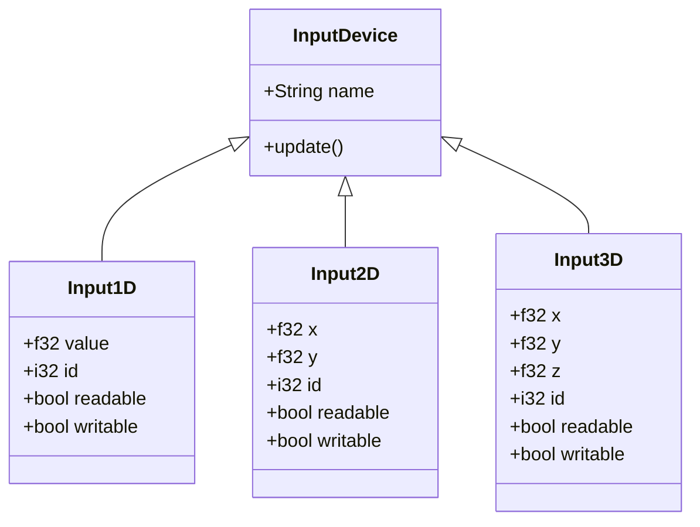

# Input Devices

The **Input** module provides polymorphic, hardware-neutral abstractions for reading user inputs and physical control axes. Input devices are structured dynamically, classifying signals into **1D**, **2D**, and **3D** coordinate systems.

These classes are typically integrated with `Graphics::GLFWDiligentWindow` to ingest input events (such as keyboards, mice, and joysticks) or hardware peripherals (such as knobs, sliders, and spatial trackers).

---

## 📐 Input Device Hierarchy

All input classes inherit from the base `InputDevice` class:



---

## 🛠️ API Reference

### InputDevice

The base interface for all input peripherals.

* **Properties**:
  * `Collection::String name`: Human-readable identifier for the device type (default: `"InputDevice"`).
* **Methods**:
  * `virtual void update()`: Polls or recalculates the hardware state of the input device.

---

### Input1D

Represents a single-axis input device (e.g. key press, button, slider, dial).

* **Properties**:
  * `f32 value`: The scalar value of the input (typically normalized between `0.0` and `1.0`).
  * `i32 id`: Hardware identifier for the specific pin or button.
  * `bool readable`: True if the host can read input from this device.
  * `bool writable`: True if the host can write output (e.g. haptic feedback) to this device.

---

### Input2D

Represents a dual-axis input device (e.g. mouse cursor offset, analog joystick, trackpad).

* **Properties**:
  * `f32 x`, `f32 y`: Coordinates of the input axis.
  * `i32 id`: Hardware identifier.
  * `bool readable`: True if readable.
  * `bool writable`: True if writable.

---

### Input3D

Represents a tri-axis input device (e.g. IMU tracker, spatial gyroscope, 3D pointer).

* **Properties**:
  * `f32 x`, `f32 y`, `f32 z`: Coordinates of the input axes.
  * `i32 id`: Hardware identifier.
  * `bool readable`: True if readable.
  * `bool writable`: True if writable.

---

## 💻 Code Examples

### 1. Linking Custom Input Devices to a Window

```cpp
#include <Graphics/Window.hpp>
#include <Input/Input.hpp>

using namespace Graphics;
using namespace Input;

// A custom button input mapped to a physical GPIO pin
class HardwareButton : public Input1D {
public:
    int pin;
    HardwareButton(int gpioPin) : pin(gpioPin) {
        name = "HardwareButton";
        id = gpioPin;
        readable = true;
    }

    void update() override {
        // Read physical button value (e.g., from hardware drivers)
        value = readPinState(pin) ? 1.0f : 0.0f;
    }
    
private:
    bool readPinState(int p) {
        // Platform specific implementation
        return true; 
    }
};

int main() {
    GLFWDiligentWindow* win = requestWindow();

    // Register our hardware button to the window inputs list
    HardwareButton* btn = new HardwareButton(12);
    win->inputs.push(btn);

    while (!win->shouldRelease) {
        win->update(); // Automatically updates win->inputs

        // Check if button is pressed
        if (btn->value > 0.5f) {
            std::printf("GPIO Pin 12 button is PRESSED!\n");
        }
    }

    delete btn;
    delete win;
    return 0;
}
```

### 2. Polling a Joystick (2D Input)

```cpp
#include <Input/Input.hpp>

using namespace Input;

int main() {
    Input2D joystick;
    joystick.id = 0; // First controller joystick

    while (true) {
        joystick.update();
        
        if (joystick.x > 0.8f) {
            std::printf("Moving Right: %f\n", joystick.x);
        } else if (joystick.x < -0.8f) {
            std::printf("Moving Left: %f\n", joystick.x);
        }
        
        Xi::sleep(16); // ~60Hz poll rate
    }
    return 0;
}
```
